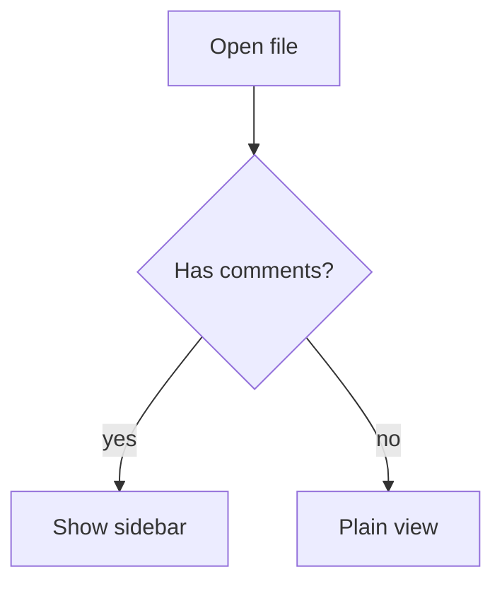

# GFM showcase

This file exercises what Forgemark renders beyond plain CommonMark. Each section names what to look for. See also [the linked document](./linked.md) and [the second heading](#inline-html).

## Inline HTML

Press <kbd>Ctrl</kbd>+<kbd>C</kbd> to copy. This is <mark>highlighted</mark>, this is <ins>inserted</ins>, and H<sub>2</sub>O has a <abbr title="subscript">sub</abbr>. A <span style="color: #d70015">red span</span> keeps its style. Hidden here: <!-- an inline comment --> a comment, and a<wbr>b has a word break.

Inline image with a width:  and a linked badge: [](https://example.com). An Obsidian embed: ![[images/swatch.png|Swatch]].

## Raw HTML blocks

<p align="center"></p>

<table>
  <tr><th>Column</th><th>Value</th></tr>
  <tr><td>rows</td><td>2</td></tr>
</table>

<details>
<summary>More detail</summary>

Body of the details block, in **Markdown**.

</details>

<!-- a block comment: shown as a quiet placeholder -->

## Alerts

> [!NOTE]
> Useful information the reader should know.

> [!WARNING]
> Careful, this can go wrong.

> [!Takeaway]-
> An Obsidian callout of a type GitHub does not know, with a fold marker.

> A plain quote, for comparison.

## Footnotes and strikethrough

A claim with a footnote[^1] and another[^note]. Struck with ~one tilde~ and ~~two~~. A lone ~ tilde and a $5 price stay as they are.

[^1]: The first note.
[^note]: The second note, which
    continues on a lazy line.

## Links

Bare addresses become links: https://example.com/a_b?c=1, www.example.com, and mail@example.com. Not links: SKILL.md and example.com. A titled link: [example](https://example.com "Example").

## Tables

| Left | Centre | Right | Pipe |
| :--- | :----: | ----: | ---- |
| a | b | c | x \| y |
| **bold** | `code` | 3 | `a\|b` |

A wide table that should scroll rather than squeeze:

| col0 | col1 | col2 | col3 | col4 | col5 | col6 | col7 | col8 | col9 | col10 | col11 | col12 | col13 |
| ---- | ---- | ---- | ---- | ---- | ---- | ---- | ---- | ---- | ---- | ----- | ----- | ----- | ----- |
| some longer text | some longer text | some longer text | some longer text | some longer text | some longer text | some longer text | some longer text | some longer text | some longer text | some longer text | some longer text | some longer text | some longer text |

## Code

```python
def greet(name: str) -> str:
    # A comment
    return f"Hello, {name}!"
```

```
no language: stays plain, never guessed
```

## Math

Inline $E = mc^2$ and a block:

$$
\int_0^1 x^2 \, dx = \frac{1}{3}
$$

```math
a^2 + b^2 = c^2
```

## Diagram



## Task list

- [x] done
- [ ] not yet
